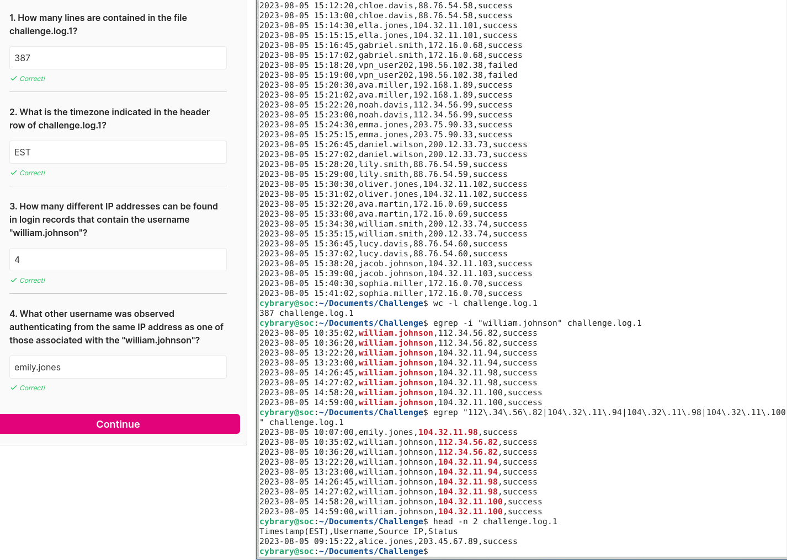
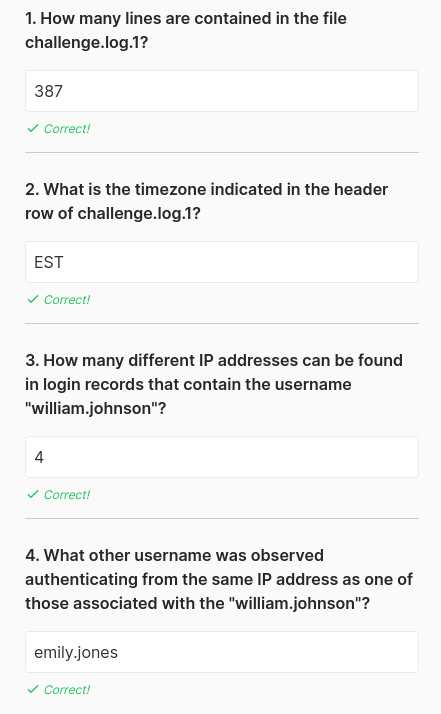
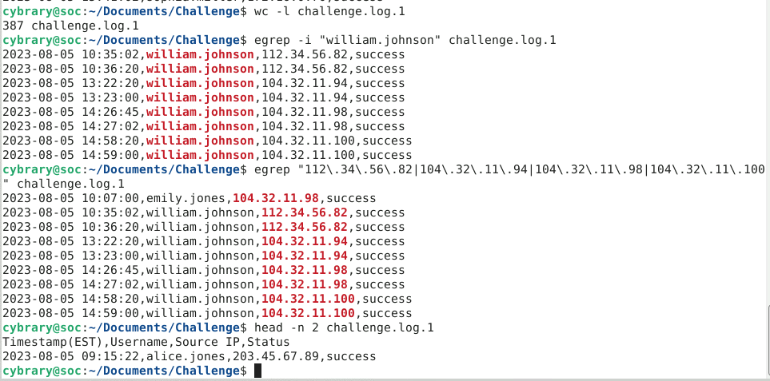
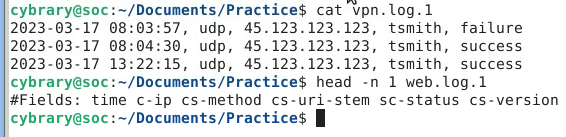
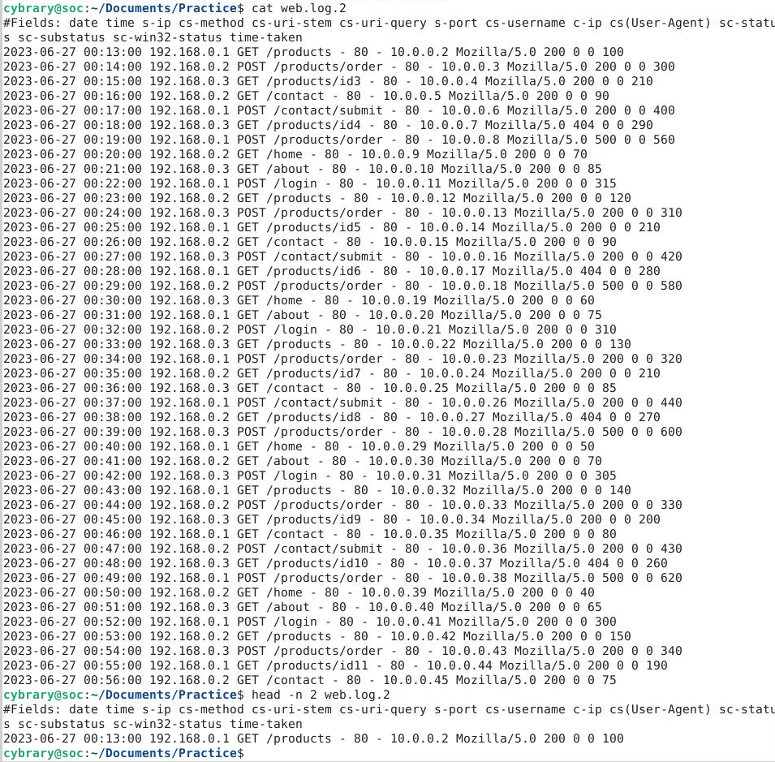
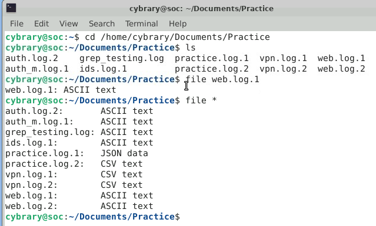

# Log Analysis – Cybrary Lab

This lab demonstrates foundational log analysis skills using Linux command-line tools. Screenshots and terminal outputs reflect progress through Cybrary’s **Log Analysis Basics** module under the SOC Analyst Career Path.

---

## 🧠 Objectives

- Explore and analyze system log files
- Identify and filter key information from `.log` files
- Practice using tools like `cat`, `head`, `tail`, `grep`, `wc`, and others
- Understand log file types and formats for system monitoring

---

## 🛠️ Commands Practiced

- `cat`, `head`, `tail` – View log contents
- `grep` – Search for patterns in logs
- `wc` – Count lines, words, and characters
- `less`, `more` – Paginate through large logs
- `file` – Identify file types
- `find` – Locate logs within directories

---

## 📸 Screenshots

Below are visual highlights of the exercises completed:

### Challenge Overview & Questions
  

### Terminal Work

### Displaying Logs
  

### File Type Identification

---

## ✅ Outcome

Completed Cybrary’s **Log Analysis Basics** lab and demonstrated ability to interact with logs using common Linux utilities. This lab serves as a base for deeper log analysis, SIEM integration, and event correlation in future modules.

📄 Certificate of Completion – Log Analysis Basics  

