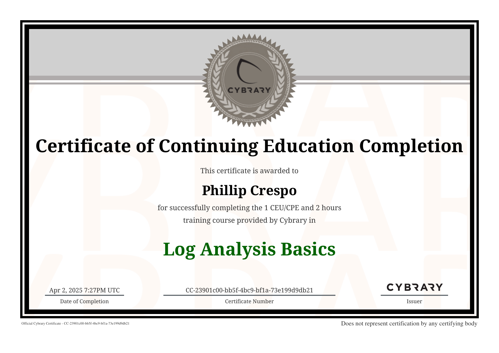
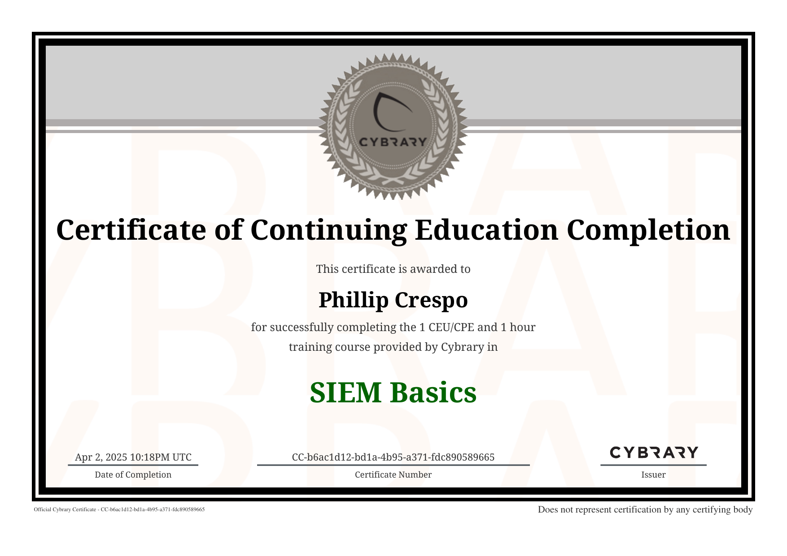
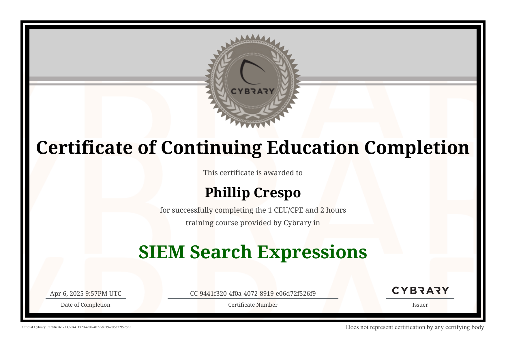
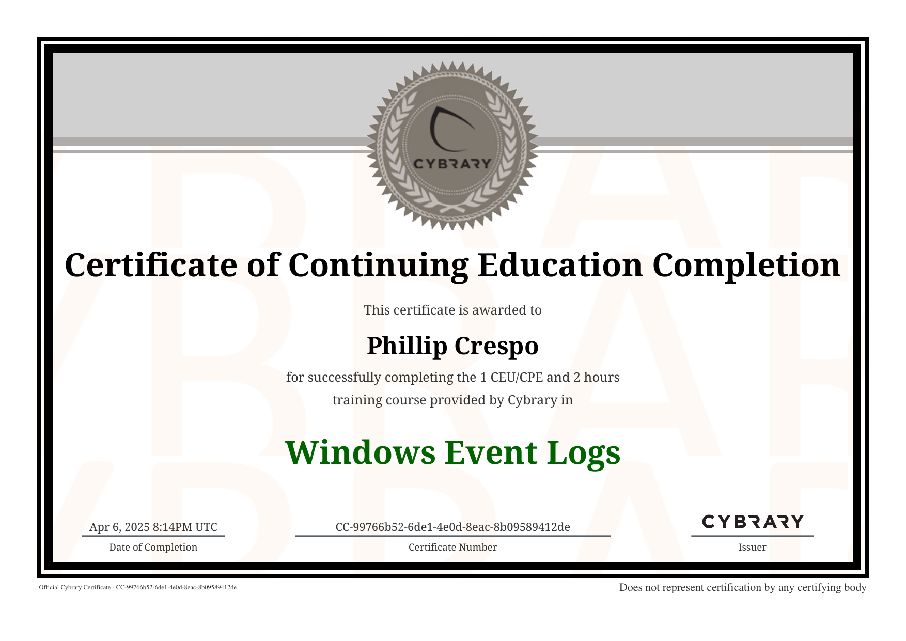

# 📚 Cybrary Labs – SOC Analyst Career Path

This directory showcases hands-on labs and certifications completed through **Cybrary** as part of my SOC Analyst learning path. Each subfolder represents a practical domain, from log analysis and SIEM operations to Windows investigations and ticketing workflows.

---

## 🗂️ Subfolders & Lab Summaries

### 🧾 `Certificates/`  
Digital badges and PDF certificates earned from Cybrary modules  
📜 Certificates Preview:  
  
  
  
  

---

### 🐧 `Log_Analysis/`  
Analyze Linux system logs using commands like `cat`, `head`, `grep`, and `wc`  
✅ **Completed:** Log Analysis Basics  
🔗 [View Lab](./Log_Analysis/README.md)

---

### 🪟 `Windows_Event_Logs/`  
Investigate Event ID 4720 (account creation) using Windows Event Viewer and Wazuh  
✅ **Completed:** Windows Event Logs Basics  
🔗 [View Lab](./Windows_Event_Logs/README.md)

---

### 📈 `Wazuh/`  
Filter logs using Lucene/DQL syntax and correlate alerts with MITRE TTPs  
✅ **Completed:**  
- SIEM Basics  
- Search Expressions in a SIEM  
🔗 [View Lab](./Wazuh/README.md)

---

### 🐝 `TheHive/`  
Simulate SOC workflows with TheHive: create, assign, annotate, and resolve tickets  
✅ **Completed:** Security Ticketing Basics  
🔗 [View Lab](./TheHive/README.md)

---

## 🔍 About These Labs

Each lab folder contains:

- 📸 Screenshots of hands-on activity
- 📝 Documentation and notes (README.md)
- 🏆 Certificates of completion

These exercises were completed as part of Cybrary’s [SOC Analyst Career Path](https://www.cybrary.it/) and support my preparation for Tier 1 SOC roles focused on log analysis, detection, and response.

---

