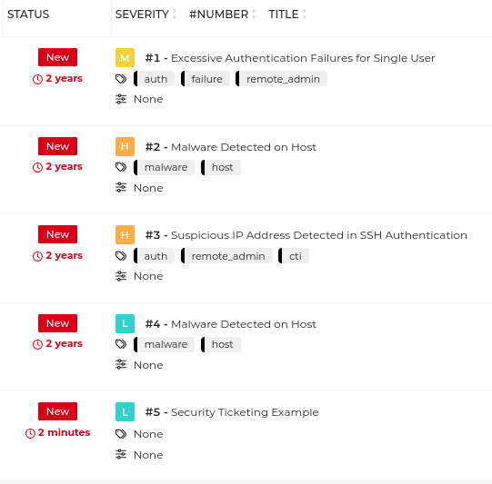

# 🐝 TheHive – Security Ticketing Lab

This section documents hands-on experience using **TheHive**, a security incident response platform (SIRP), to simulate real-world SOC workflows. Activities included ticket creation, assignment, annotation, and closure, forming the foundation of incident management and response tracking.

---

## 🎯 Objectives

- Understand how security incidents are reported and tracked
- Practice creating and assigning tickets
- Annotate events and collaborate within a ticketing queue
- Simulate incident lifecycle management from detection to resolution

---

## 🔁 Ticketing Workflow in TheHive

### 📥 Ticket Creation

### 🧑‍💻 Ticket Assignment

### 📝 Ticket Annotation

### 📤 Closing the Ticket
  

---

## 📂 Queue Management

Once created, tickets are automatically added to a queue for analysts to triage.

  

---

## ✅ Outcome

Completed Cybrary's **Security Ticketing Basics** lab using TheHive. Demonstrated proficiency in navigating the platform, managing tickets, and simulating analyst responsibilities.

