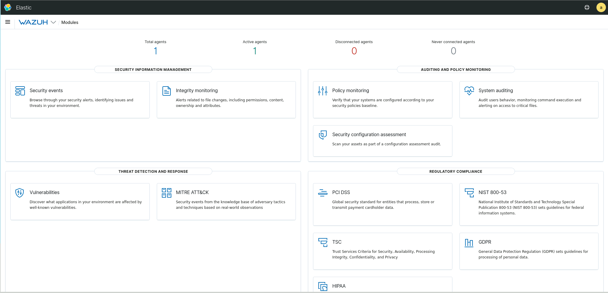
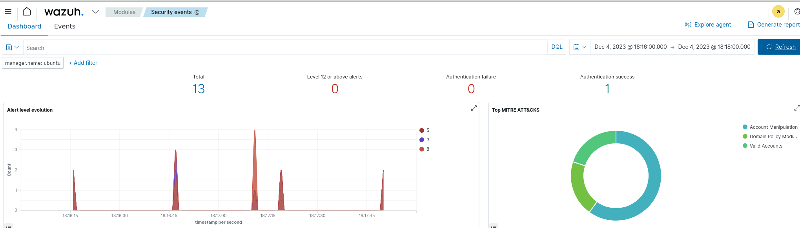
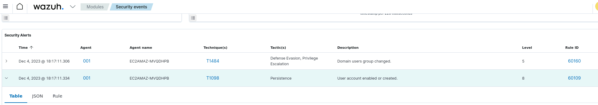
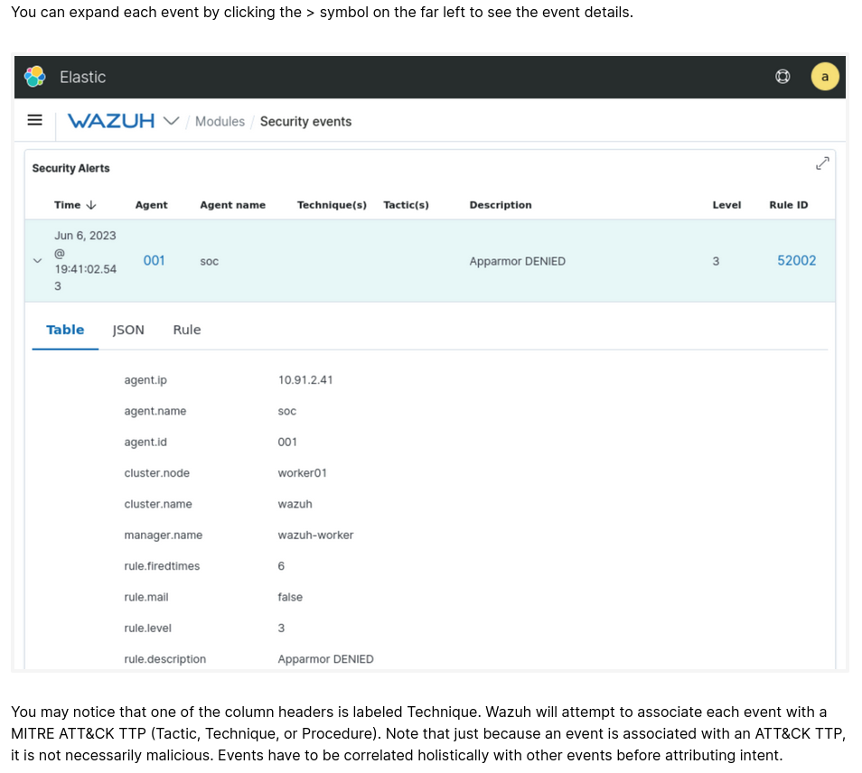
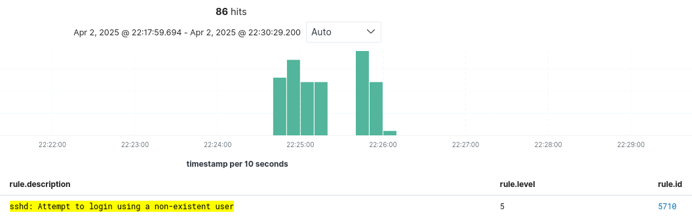
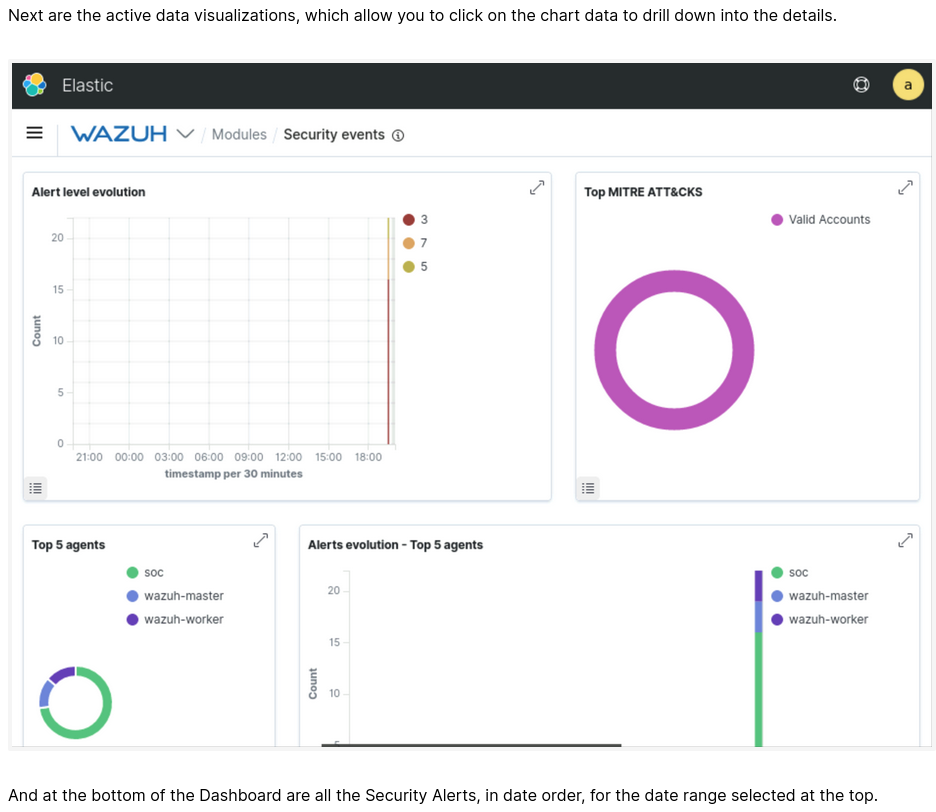
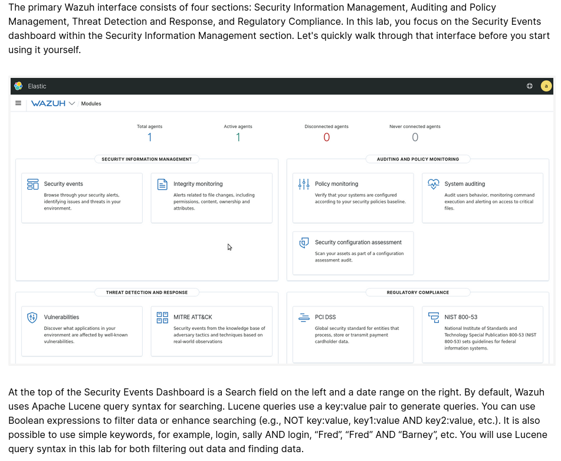
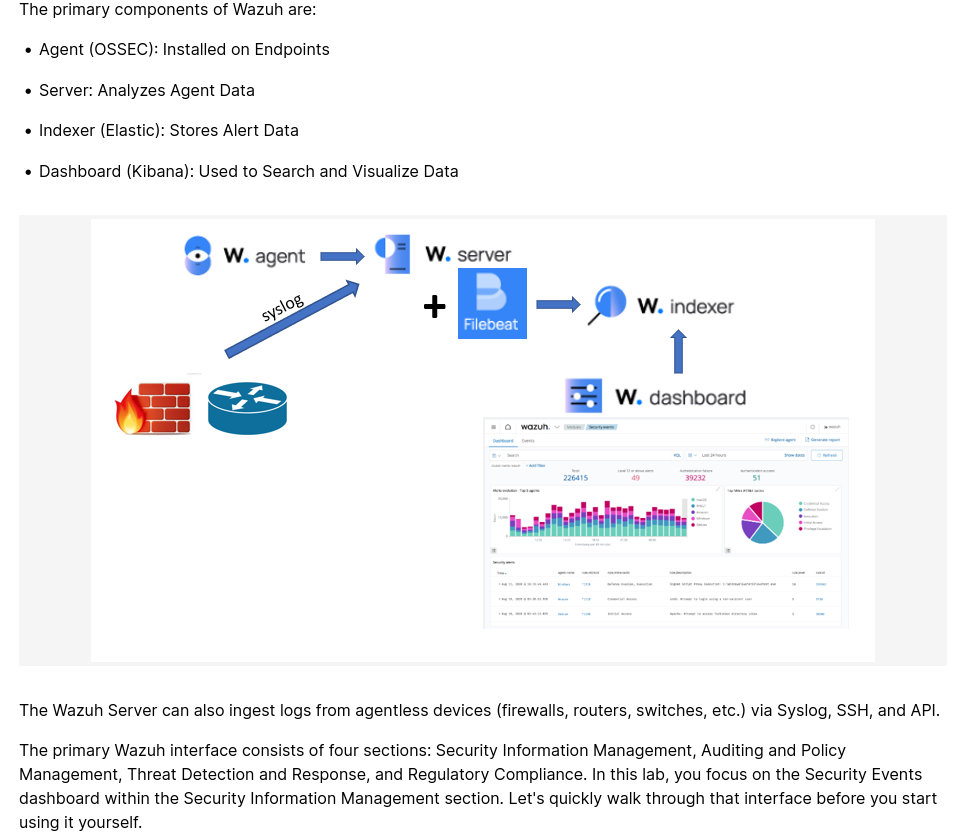

# 🛡️ Wazuh SIEM Labs – Search Expressions & Event Correlation

This section contains hands-on labs using the **Wazuh SIEM** interface to analyze Windows security logs, filter events using Lucene syntax, and correlate real-time alerts with MITRE ATT&CK TTPs.

---

## 📊 Wazuh Main Dashboard

Explore event levels, MITRE correlations, and alert timelines.

---

## 🔍 Using Lucene Filters for Precision Search

Filtering specific logs using `rule.description`, `manager.name`, `eventID`, and usernames with DQL syntax.

---

## 📎 MITRE Technique T1098 - User Account Creation

Wazuh detected the creation of the `Pikachu` account and mapped it to MITRE ATT&CK T1098 (Persistence).

---

## 📄 Correlating Alerts & Viewing Event Details

In-depth alert breakdown including rule IDs, agent info, and timestamps.

---

## ✅ SIEM Challenge Completion

Completed challenge by identifying correct users, filters, and answering correlation questions in Wazuh.

---

### 📸 Other Notable Screens

<table>
  <tr>
    <td></td>
    <td></td>
  </tr>
  <tr>
    <td>MITRE T1098 Alert (User Creation)</td>
    <td>Data Visualization of Alerts</td>
  </tr>
  <tr>
    <td></td>
    <td></td>
  </tr>
  <tr>
    <td>AppArmor DENIED Alert</td>
    <td>Interface Module Breakdown</td>
  </tr>
  <tr>
    <td colspan="2" align="center"></td>
  </tr>
  <tr>
    <td colspan="2" align="center">Elastic Modules Overview</td>
  </tr>
</table>

---

## 🧠 Skills Practiced

- SIEM log correlation
- Lucene/DQL search syntax
- Event Viewer + Wazuh side-by-side analysis
- MITRE ATT&CK mapping
- Real-world alert triage & filtering

---

## 🏁 Outcome

Successfully completed Wazuh SIEM labs and gained hands-on experience with log filtering, correlation, and detection workflows using the Wazuh dashboard.

### 📜 Certificate of Completion

[🔗 View PDF Certificate](../Certificates/cybrary-cert-siem-basics.pdf)

---

## 📄 Additional Certification

This lab is part of the broader **SIEM Search Expressions in a SIEM** series. The certificate earned for mastering DQL search syntax and SIEM query logic is included here due to its strong relevance to the Wazuh search filters and log analysis exercises.

[🔗 View PDF Certificate – Search Expressions in a SIEM](../Certificates/cybrary-cert-search-expressions-in-a-siem.pdf)

