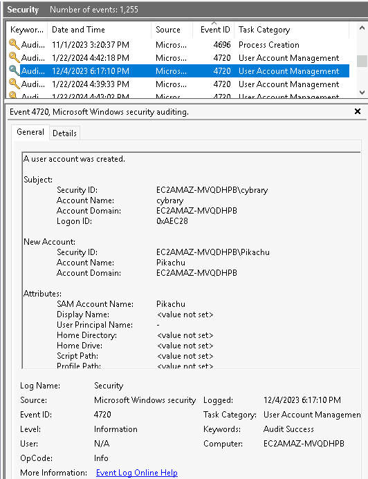

# 🪟 Windows Event Logs – Cybrary Lab

This section contains hands-on analysis of Windows Event Logs, specifically around account creation (Event ID **4720**). Events were examined using both **Windows Event Viewer** and **Wazuh SIEM** for validation and correlation.

---

## 🧠 Objectives

- Use Windows Event Viewer to identify account creation logs
- Filter by Event ID `4720` (A user account was created)
- Validate results using Wazuh SIEM’s alert engine
- Correlate events with MITRE ATT&CK techniques

---

## 🛠️ Tools Used

- Windows Event Viewer
- Wazuh SIEM Dashboard
- PowerShell for service control (`net stop wazuh`, `net start wazuh`)
- Host file update for agent-server sync

---

## 📸 Screenshots

### Account Creation Analysis

- 
- 
- 
- 

---

### Challenge Instructions & Answers

- 
- 
- 

---

### User Filtering with Event ID 4720

- 
- 

---

### Individual Answers

- 
- 
- 

---

### Support Tools & Host Adjustments

- 
- 
- 
- 
- 
- 
- 
- 

---

## ✅ Outcome

Completed a full lab investigation of Windows security events related to account creation, verified event ID 4720 presence using Event Viewer, and cross-validated data using Wazuh SIEM.

Successfully practiced MITRE mapping (T1098), log correlation, PowerShell agent restarts, and network troubleshooting.

---

## 📄 Certificate of Completion

