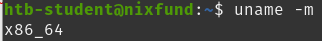
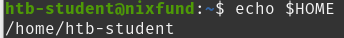
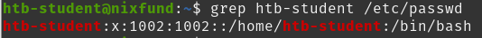
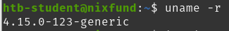
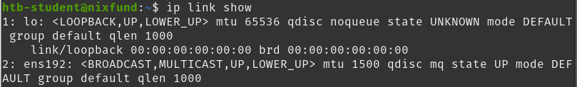

# Linux Fundamentals – HTB Academy

**Platform:** HTB Academy  
**Module:** Linux Fundamentals  
**Status:** In Progress

---

## 🧠 Questions & Answers

1. **Find out the machine hardware name**  
   Answer: `x86_64`  
   

2. **What is the path to the htb-student's home directory?**  
   Answer: `/home/htb-student`  
   

3. **Which shell is specified for the htb-student user?**  
   Answer: `/bin/bash`  
   

4. **Which kernel release is installed on the system?**  
   Answer: `4.15.0`  
   

5. **What is the name of the network interface that MTU is set to 1500?**  
   Answer: `ens192`  
   

---

## ✅ Next Steps
- [ ] Complete remaining Linux Fundamentals module
- [ ] Start Windows Fundamentals module
