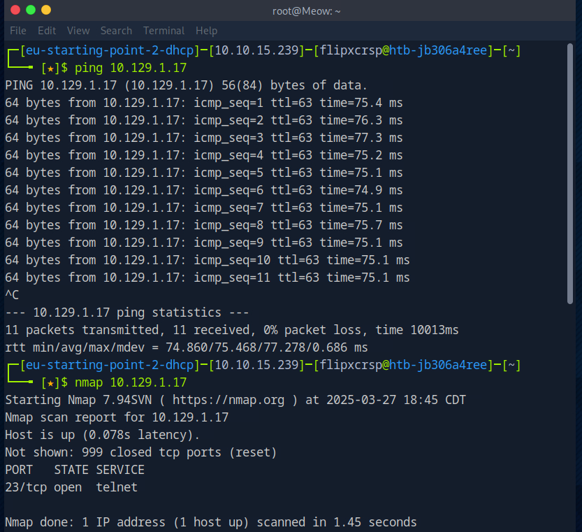
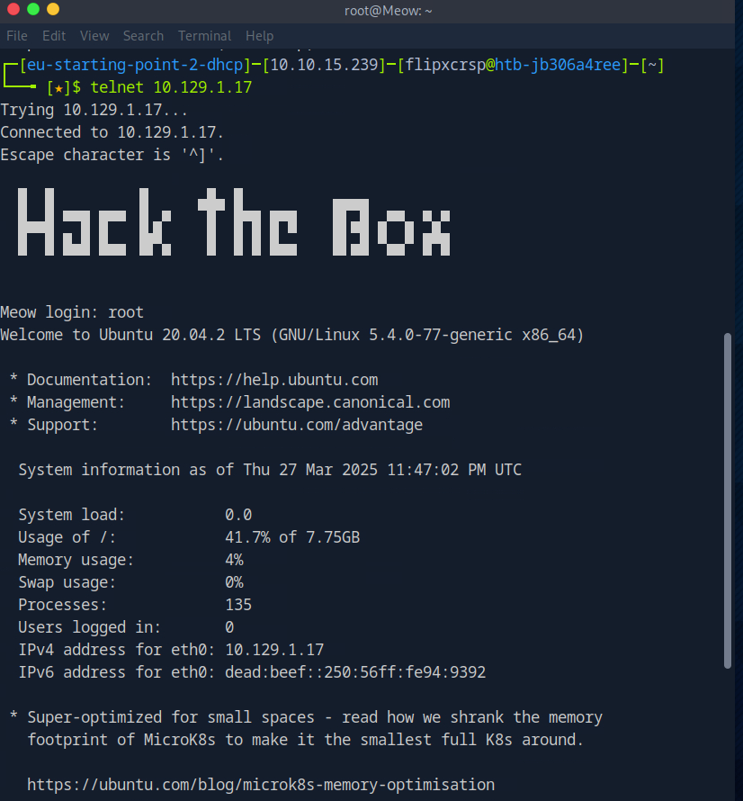
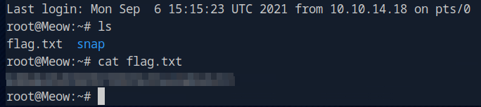
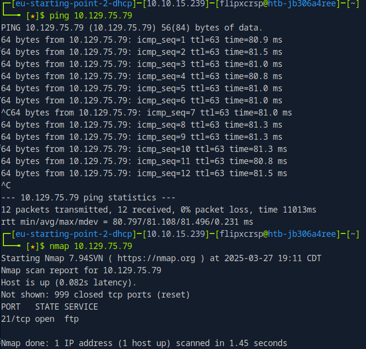
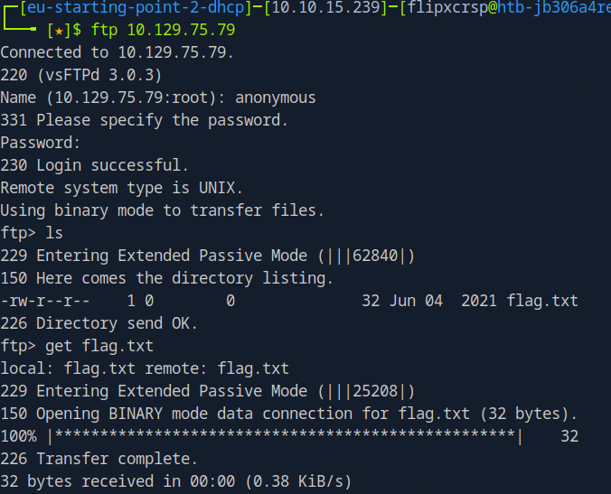
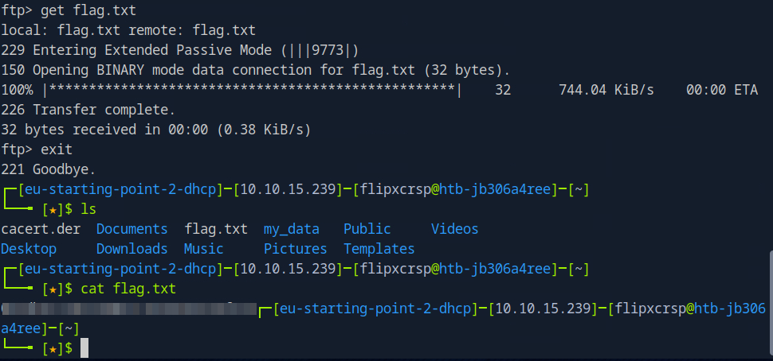
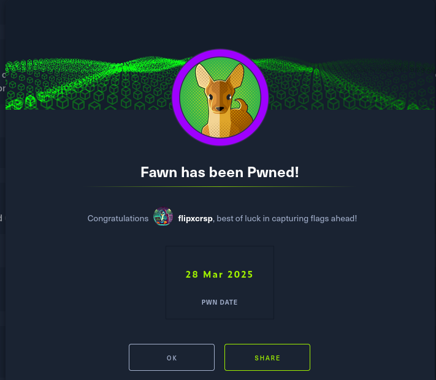
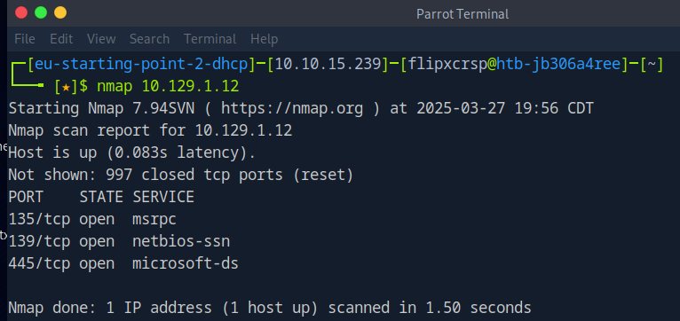
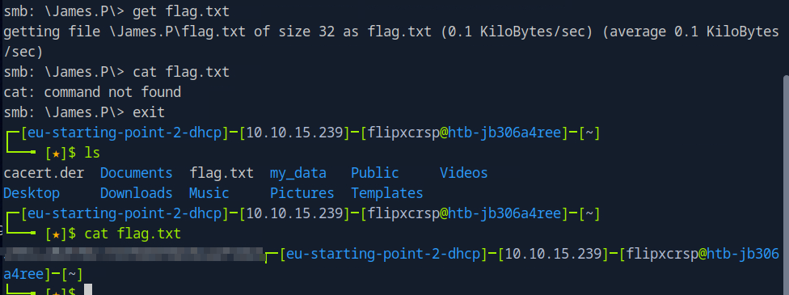

# HTB Starting Point Machines

Documented walkthroughs for the "Starting Point" series on Hack The Box.

---

## 🐱 Meow
**Protocol:** Telnet  
**IP Address:** 10.129.1.17  
**Summary:** Discovered open Telnet port with Nmap. Used default login to access the system and read the flag.

### 🔍 Enumeration
```bash
ping 10.129.1.17
nmap 10.129.1.17
```
📸 

### 💻 Exploitation
```bash
telnet 10.129.1.17
```
📸 

### 🏁 Flag
```bash
cat flag.txt
```
📸 

### ✅ Pwned!
📸 

---

## 🦌 Fawn
**Protocol:** FTP  
**IP Address:** 10.129.75.79  
**Summary:** Anonymous FTP login allowed access to `flag.txt`.

### 🔍 Enumeration
```bash
ping 10.129.75.79
nmap 10.129.75.79
```
📸 

### 💻 Exploitation
```bash
ftp 10.129.75.79
# login as anonymous
get flag.txt
```
📸   
📸 

### ✅ Pwned!
📸 

---

## 💃 Dancing
**Protocol:** SMB  
**IP Address:** 10.129.1.12  
**Summary:** Found readable share via SMB. Navigated directories using `smbclient` and retrieved flag.

### 🔍 Enumeration
```bash
nmap 10.129.1.12
smbclient -L 10.129.1.12
```
📸   
📸 

### 💻 Exploitation
```bash
smbclient //10.129.1.12/WorkShares -U guest
cd James.P
get flag.txt
```
📸   
📸 

### ✅ Pwned!
📸 
