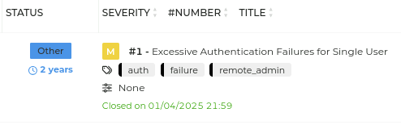
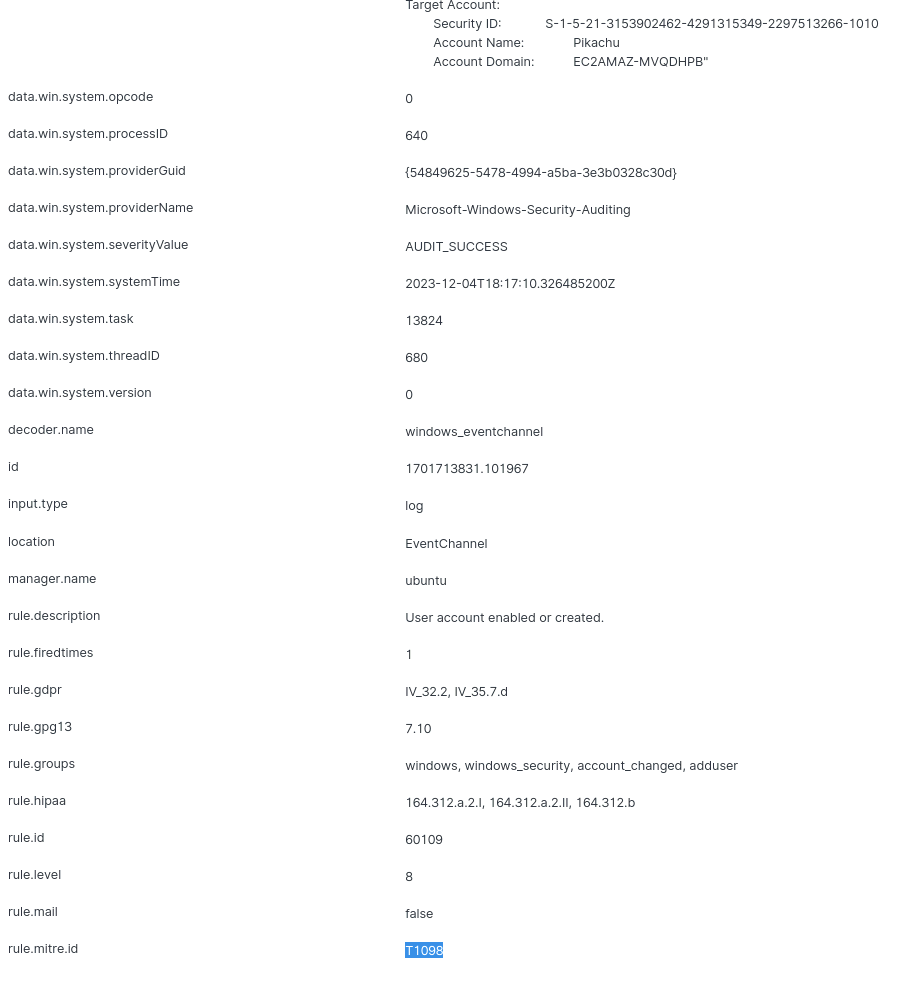
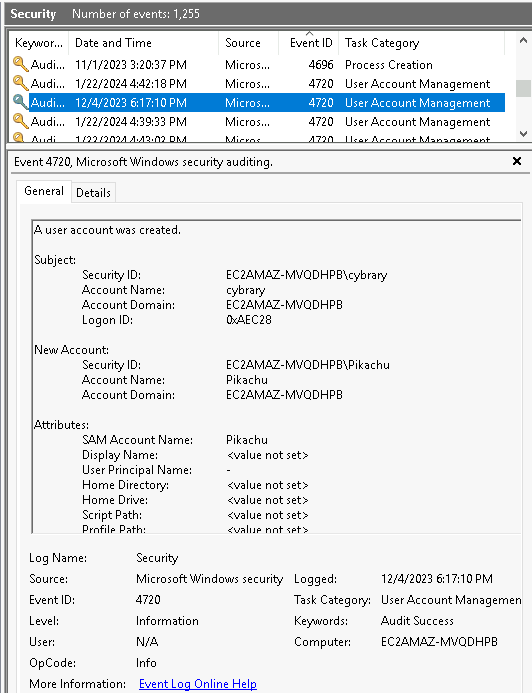

# SOC-Skillsets

> Documenting the grind toward having a better understanding of what tools and methods are used in SOC environments.
> Labs, guided modules, CTF exercises, and practical examples across various platforms.
> Although a lot of my focus is in support/sales engineering, I'm fascinated in how cybersecurity tools are used!

---

## 🔍 Overview
This repo serves as a hub for cybersecurity skillsets, with a focus on skills and tools relevant to real-world exploits.

The structure includes:
- 🧠 **HTB Academy** – SOC Analyst Prerequisites path (Linux, Windows, Bash, Networking, Nmap, etc.)
- 💻 **HTB Machines** – Starting Point & beyond write-ups
- 🧩 **TryHackMe** – room walk-throughs, flags, and tool usage
- 📚 **Cybrary** – SOC Analyst Career Path milestones, notes, and practicals

---

## 📂 Repo Structure

SOC-Path/  
├── HTB_Academy/              # Notes and labs from HTB Academy  
│   ├── Linux_Fundamentals.md  
│   └── screenshots/  
├── HTB_Machines/             # Write-ups from Hack The Box machines  
│   ├── Starting_Point.md  
│   └── screenshots/  
├── TryHackMe/                # Room-based exercises  
├── Cybrary/  
│   ├── Certificates/             # Downloaded Cybrary completion certs (PDF)  
│   ├── SIEM_Search_Exp/          # Screenshot series from Wazuh SIEM search challenge  
│   ├── Windows_Event_Logs/       # Screenshots from Windows Event Log analysis and Wazuh filtering  
│   ├── Log_Analysis/             # Screenshot sequence of Cybrary’s log filtering challenge  
│   ├── The_Hive/                 # Security ticketing workflows in TheHive  
│   └── Wazuh/                    # MITRE ATT&CK detections, rule filters, and dashboard visuals  
└── README.md  

---

## ✅ Progress Snapshot
- [x] HTB Academy: SOC Analyst Prerequisites  
- [x] TryHackMe: Cyber Security 101 Path  
- [ ] TryHackMe: SOC Level 1 Path  
- [x] Cybrary: SOC Analyst Career Path  

---

## 📜 Certificates

- [SIEM Basics](Cybrary/Certificates/cybrary-cert-siem-basics.pdf)  
- [Search Expressions in a SIEM](Cybrary/Certificates/cybrary-cert-search-expressions-in-a-siem.pdf)  
- [Log Analysis Basics](Cybrary/Certificates/cybrary-cert-log-analysis-basics.pdf)  
- [Security Ticketing Basics](Cybrary/Certificates/cybrary-cert-security-ticketing-basics.pdf)  
- [Windows Event Logs Basics](Cybrary/Certificates/cybrary-cert-windows-event-logs-basics.pdf)  

---

## 🧰 Tools Covered So Far

**Blue Team & Monitoring:**  
Splunk, Zeek, Suricata, Wazuh, Graylog, tcpdump, Wireshark, OpenVAS, Lynis, Fail2ban, TheHive, Security Onion

**Offensive Tools:**  
Metasploit, Hydra, Nmap, Burp Suite

**OSINT & Reconnaissance:**  
Recon-ng, Shodan, TheHarvester

**Scripting & Automation:**  
Bash, PowerShell, Python, YAML, JSON, Ansible, Docker

**Frameworks & Concepts:**  
MITRE ATT&CK, log analysis, IDS/IPS, ticketing workflows, SIEM, SSH, firewalls, UFW, syslog, DNS/DHCP, VLANs, NAT

---

## 🔍 Notable Screens (from Labs)

**TheHive Ticket Lifecycle:**  
  

**Wazuh MITRE Rule Detection (T1098):**  

**Windows Event Log Analysis:**  

---

## 🧠 Goal
Build a visible, technical portfolio to demonstrate SOC tools — showcasing tools, detection, response techniques, and real-world application. This includes:  
- Learning structured SOC modules from HTB Academy, TryHackMe, and Cybrary  
- Practicing ticketing and detection workflows using platforms like TheHive and Wazuh  
- Capturing screenshots, answering questions, and showing methodology  

---

**Maintained by [flipxcrsp](https://github.com/flipxcrsp)**  
*“The grind, one lab at a time.”*
