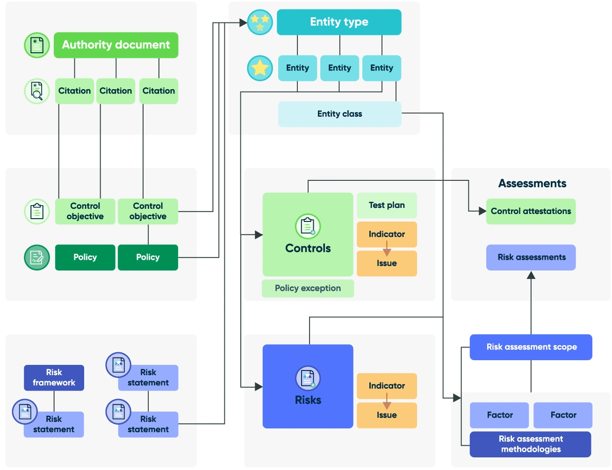

# 📘 IRM Fundamentals – ServiceNow GRC Training Summary

This document summarizes my learning and hands-on experience from the **ServiceNow GRC: Integrated Risk Management (IRM) Fundamentals (Xanadu)** course. It provides a structured walkthrough of IRM components and workflows, mapped to real-world GRC scenarios that apply to SOC operations, compliance management, and enterprise risk strategy.

---

## 🧭 GRC Architecture Overview

Understanding the relationship between authority documents, policies, control objectives, risks, and entities is key to mastering how ServiceNow GRC works as a unified system.

This high-level architecture diagram visualizes how core GRC components connect:




## 🧭 Configurable GRC Workspaces

Role-based dashboards help GRC personas manage tasks, issues, and assessments.

### 🎯 Key Workspace Roles
- **Compliance Workspace** – For IT and Corporate Compliance Managers
- **Risk Workspace** – For Operational, IT, and Business Risk Managers

### 🧰 Workspace Features
- Unified task view with filters
- Issues overview by priority and trend
- List view of relevant GRC records
- 360° record relationship viewer
- Visibility into policy exceptions and acknowledgment status

---

## 🧠 Core GRC Architecture & Tables

### 🔹 Authority Documents & Citations
- Store external regulations (e.g., PCI-DSS, GDPR)
- Citations represent enforceable requirements within documents

### 🔹 Policies & Control Objectives
- Policies define internal compliance expectations
- Control Objectives break down policies into measurable items
- Linked to citations to show alignment with regulations

### 🔹 Control Records
- Controls are scoped to specific entities
- Generated automatically when control objectives are mapped to entity types

### 🔹 Risk Frameworks & Statements
- Frameworks group related risk statements
- Statements define organizational risks and can be scoped across entities
- Can have parent-child hierarchy (Advanced Risk required)

### 🔹 Entities, Types, Classes, and Tiers
- **Entities**: People, places, objects (e.g., branches, servers, databases)
- **Entity Types**: Groups of similar entities (e.g., all data centers)
- **Entity Classes**: Metadata tags for filtering/reporting (e.g., Facility, Application)
- **Entity Tiers**: Logical groupings of classes for hierarchy-based reporting (e.g., IT Assets)

---

## 🧩 Entity Framework Deep Dive

### Purpose
Entities enable scoping of risks and controls to individual items (e.g., servers, branches).

### Key Components:
- **Entity Filters**: Define conditions to generate entities from source tables
- **Entity Ownership**: Auto-assigned from source fields (e.g., Managed by)
- **Dynamic Sync**: Updates entity owner and syncs to risks and controls
- **Automation**: Auto-generate risks and controls based on entity filter matches

### Entity Record Lifecycle:
- Entities can be added/removed dynamically based on filter conditions
- Risks and controls deactivate/reactivate based on entity status

### Entity Management Principles:
- Entities can belong to multiple entity types but only one entity class
- Entity class can be assigned via filter or class rule (only one rule per table)
- Entities can be scoped to policies, risks, or audits
- Entity filters drive automatic creation/deactivation of scoped records

### Entity Type Scoping Approaches:
- **Granular (Operational)**: E.g., every POS system individually monitored
- **High-Level (Strategic)**: E.g., business processes or departments grouped

### Automation in Action:
- Linking entity types to control objectives (with "Creates controls automatically" enabled) → generates controls for each new entity
- Linking entity types to risk statements → generates registered risks
- Entity deactivation retires associated risks/controls
- Reactivation resets state to Draft

---

## 🧾 Introduction to Compliance Management

Compliance management in ServiceNow GRC ensures that organizations follow internal policies and meet external regulations.

### Key Concepts:
- **Policies** define internal expectations to meet external standards
- **Control Objectives** break policies into actionable controls
- **Citations** link external standards to internal controls
- **Acknowledgement Campaigns** promote awareness and tracking
- **Compliance users** can send, manage, and monitor policy acknowledgement campaigns

### Policy Types:
1. Policy
2. Procedure
3. Standard
4. Plan
5. Checklist
6. Framework
7. Template

### Compliance Workspace Highlights:
- View open and overdue issues
- Monitor campaign status
- Track policy exceptions
- Manage control attestations

---

## 📝 Policy Lifecycle & Acknowledgement
```
Draft → Review → Awaiting Approval → Published → Retired
```

### Authoring:
- Collaborative editing via Office365/Google Drive
- Redlining, comments, and version tracking
- Activity logs + history view

### Acknowledgement Campaigns:
- Targeted audience + scheduling (e.g., annual, quarterly)
- Respond with: Accept / Decline / Request Exception
- Auto-cancel tasks for users who leave org
- Acknowledgement results track Accept/Decline/Exempt status

---

## 🛡 Control Implementation & Monitoring

### Control Lifecycle
```
Draft → Attest → Review → Monitor → Retired
```

### Control Types:
- **Standard**: One-to-one mapping to an entity
- **Common**: One-to-many (shared across entities), reduces testing load

### Control Validation Methods:
- **Attestation**: Confirms implementation (Yes/No + Evidence)
- **Indicators**: Automated/manual scoring for effectiveness
- **Control Tests**: Used for audit validation of design and operation

### Consolidated Attestations:
- Group multiple attestations based on same questionnaire
- Complete in bulk (if assigned and not cancelled/complete)

---

## 🔄 Risk Assessment Lifecycle
```
Draft → Assess → Respond → Monitor → Retired
```

### RAM Features:
- Inherent → Residual → Target Risk progression
- Custom scoring methodologies
- Multi-factor evaluation (automated + manual)

### Roles:
- ARA Creator: Defines factors/methodologies
- ARA Assessor: Takes and completes assessments
- ARA Admin/Manager: Oversees ARA config and approval

---

## 🚦 Risk Response Strategies
- **Accept** – Tolerate with justification
- **Avoid** – Eliminate root cause
- **Mitigate** – Apply controls
- **Transfer** – Outsource/insure

```
State progression: Draft → WIP → Approval → Review → Closed
```

---

## 🧱 Risk Architecture

### Risk Statement
- Template to generate risk records scoped to entities
- Related to multiple risks
- Can be linked to control objectives (creates mitigating controls)
- Parent-child hierarchy enabled with Advanced Risk

### Risk Register
- Tracks all organizational risks
- Includes likelihood, impact, score, and response

### Risk Appetite vs Tolerance vs Threshold:
- **Appetite** – How much risk the org is willing to take
- **Tolerance** – Acceptable deviation from appetite
- **Threshold** – When risk must be addressed

---

## 📊 Risk Workspace

### Persona-Based Workspaces
- **Operational Risk Manager**: Oversees enterprise risk posture
- **Business Risk Manager**: Manages unit-level risk
- **IT Risk Manager**: Leads IT-specific risk mitigation

### Features
- Heatmap: View inherent → residual → target risk
- Risk Trend: Score movement over last 5 assessments
- Indicators/KRIs and breached metrics
- Unified task and issue views

---

## 📈 Indicators for Continuous Monitoring

### Indicator Types:
- **Manual** – From external sources
- **Basic** – Automated from SN tables
- **Scripted** – Custom data collection

### Templates:
- Linked to control objectives or risk statements
- Auto-generate indicators per entity

---

## 🔍 Strategic Takeaway

Understanding GRC requires:
- A holistic view of compliance, risk, and control integration
- Automating workflows across the enterprise
- Communicating compliance posture and risk exposure clearly

This course reinforced key skills for SOC, compliance analyst, and GRC roles, including:
- RAM creation and scoring logic
- Issue lifecycle tracking
- Control automation with entity filters
- Hands-on risk response workflows

---

## 📸 Visual Proof
Badge and screenshots can be found in [../Screenshots](../Screenshots)

---

## 💼 About This Repo
This content is part of my dedicated ServiceNow-GRC repository. For more information about how GRC supports cybersecurity and business alignment, check out the [main README](../README.md).

