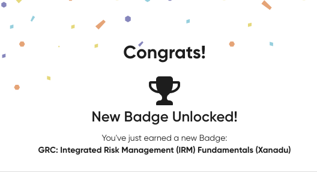
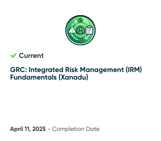

# 📘 ServiceNow GRC Training

This directory documents my learning journey with ServiceNow's **Governance, Risk, and Compliance (GRC)** platform, starting with the **Integrated Risk Management (IRM) Fundamentals (Xanadu)** course.

As a cybersecurity professional pursuing SOC Analyst and Risk Operations roles, I believe it's important to understand how **security operations align with business governance, regulatory frameworks, and risk mitigation strategies**.

By learning how enterprise GRC platforms function — from policy lifecycles to control automation and risk scoring — I’ve gained a deeper understanding of how **security efforts support both technical and organizational goals**.

---

## 🎓 Completed Training

### 🔹 Integrated Risk Management (IRM) Fundamentals (Xanadu)
- **Platform:** ServiceNow Now Learning
- **Completed:** April 11, 2025
- **Skills Gained:**
  - Policy and Control Mapping
  - Entity Framework Design
  - Risk Assessment Methodologies (RAM)
  - Compliance Lifecycle Management
  - Role-Based Workspaces (IT/Operational/Business Risk)
  - Continuous Monitoring with Indicators and KRIs

👉 Full write-up available in [`IRM_Fundamentals.md`](./IRM_Fundamentals.md)

---

## 📸 Visual Proof

  

---

## 🔭 What’s Next?

This section will expand with additional ServiceNow modules or real-world GRC implementation notes as I continue deepening my experience in risk operations and compliance automation.
