# TryHackMe – Cyber Security 101

**Path**: Cyber Security 101  
**Status**: In Progress  
**Room Highlights**: Linux Fundamentals Part 1 & 2, Defensive Security, Search Skills, Offensive Security, FakeBank

---

## 🧩 Path Progress Overview

All completed rooms in the **Cyber Security 101** learning path are shown below:

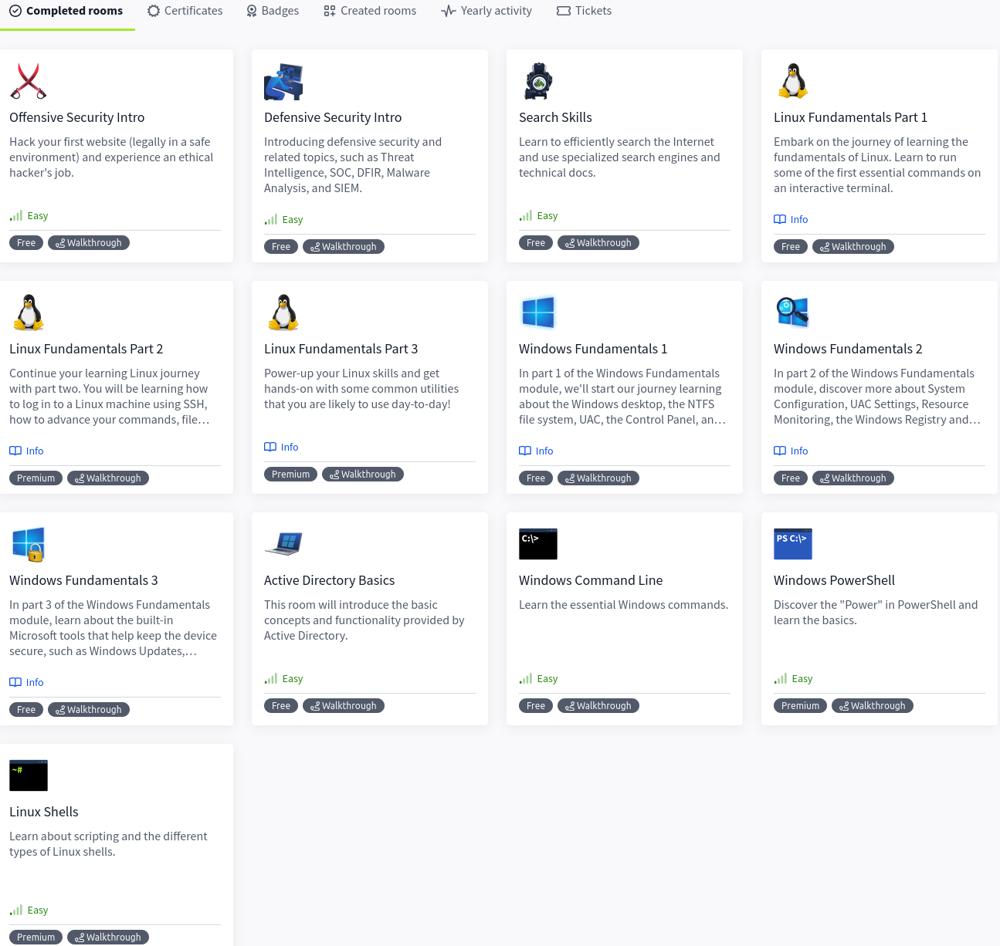

---

## 🧠 Selected Labs & Highlights

### ✅ Defensive Security Intro  
🛡️ Investigated suspicious activity and escalated SIEM alerts

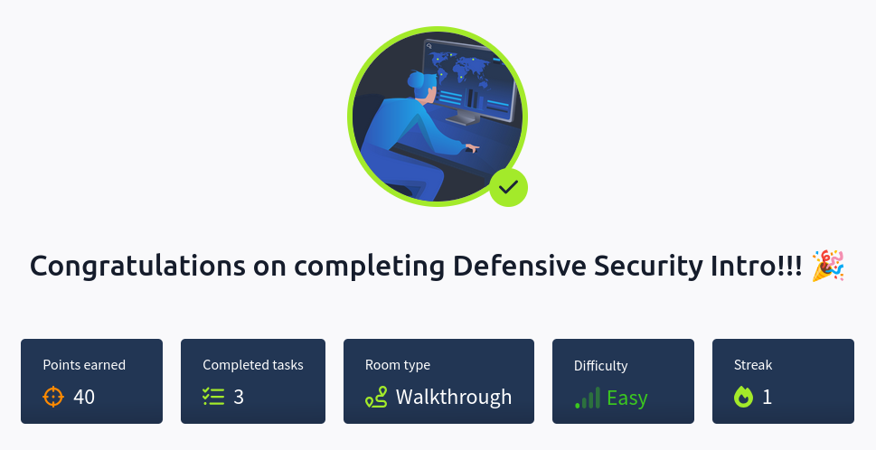  
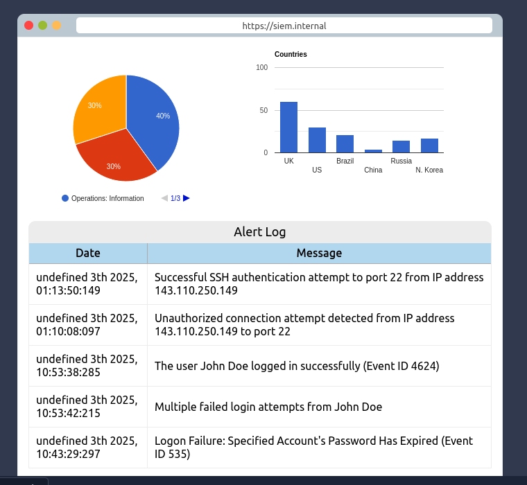  

---

### ✅ FakeBank Challenge  
Performed directory brute-forcing with Gobuster.  
Discovered `/bank-transfer` endpoint.  
Transferred funds and captured the flag.

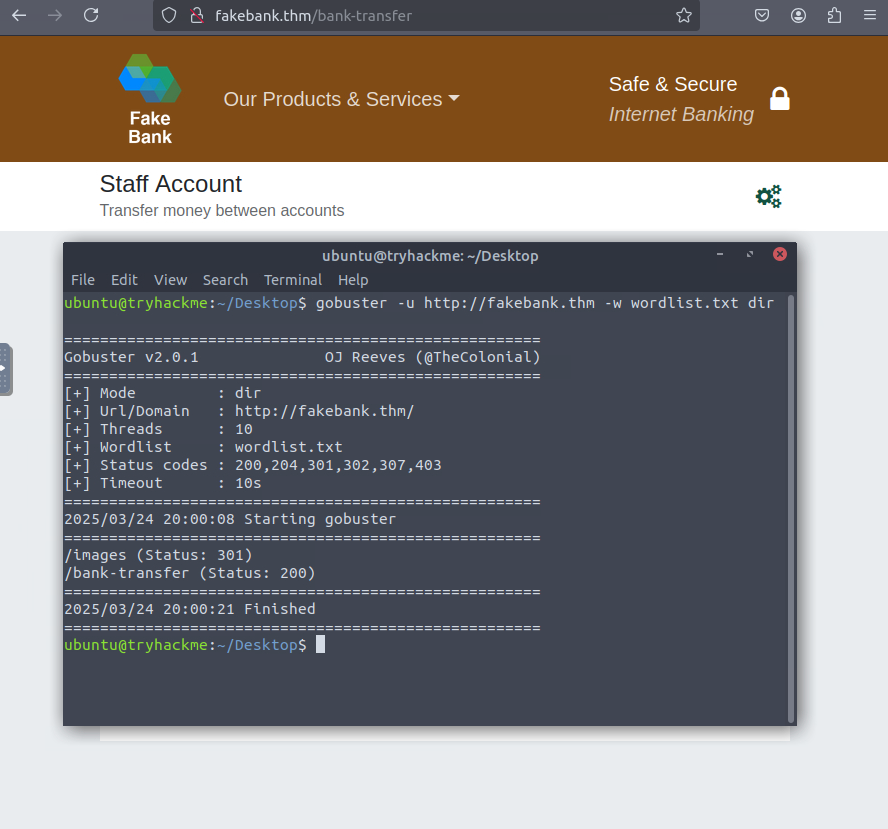  
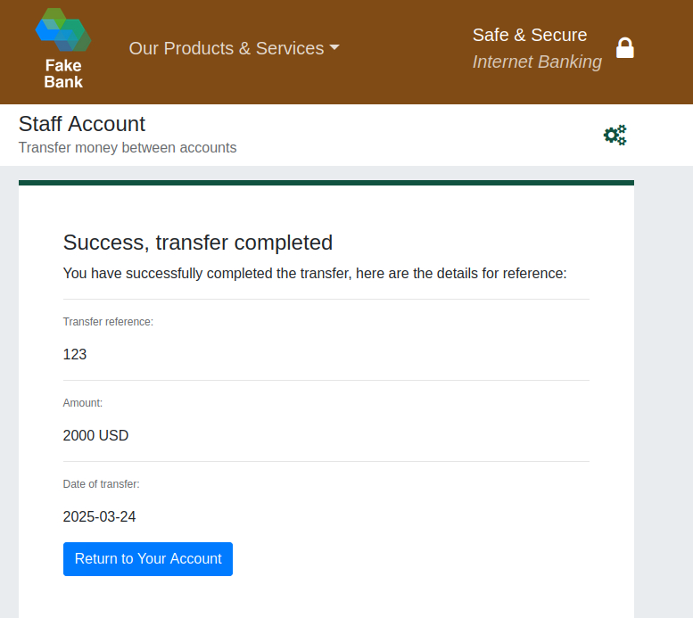  
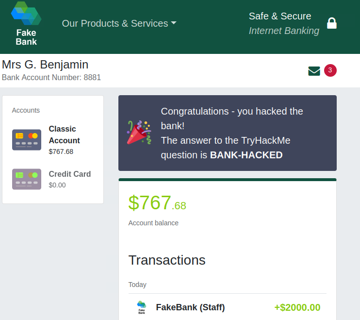

---

### ✅ Threat Hunting Mini-Challenge  
Identified and analyzed a malicious IP from SIEM logs.  
Created a firewall rule to block the attacker.

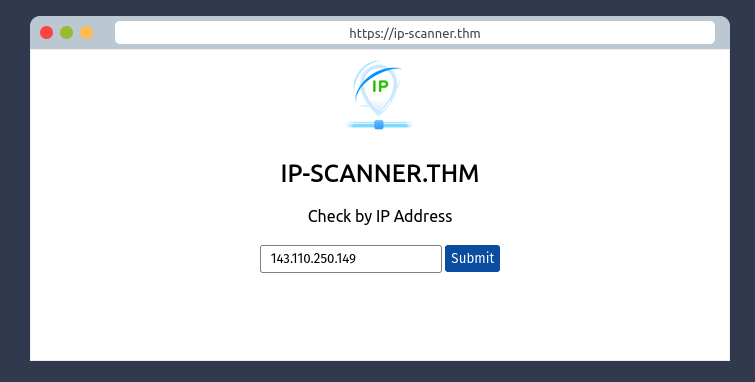  
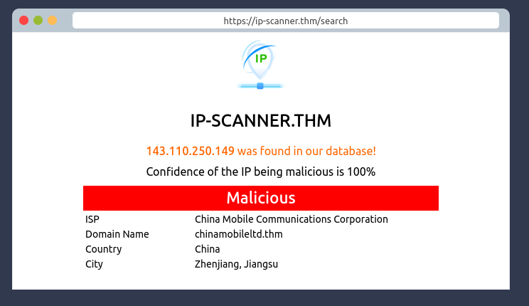  
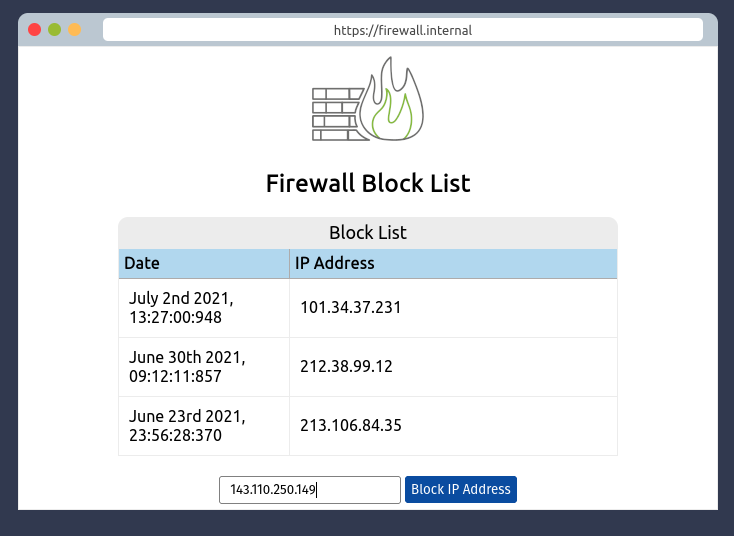  
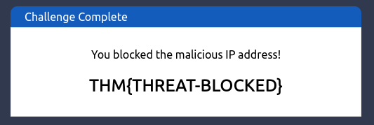

---

## 🛠️ TryHackMe AttackBox Reference

_Environment Used in Cyber Security 101 Path_  
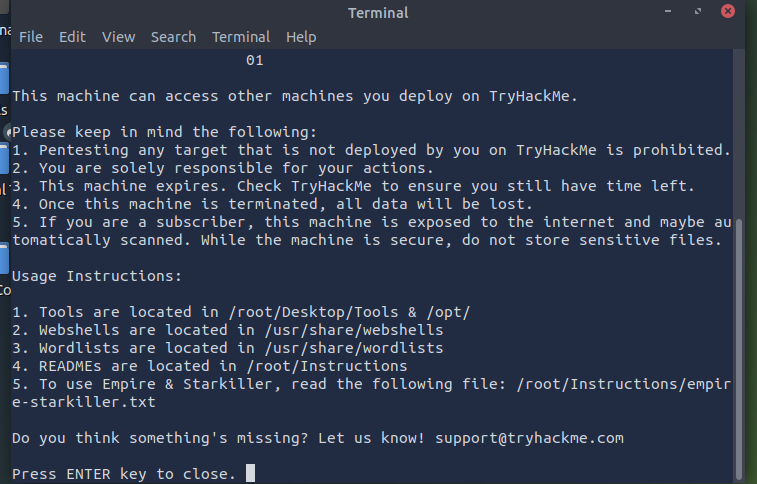

---

## ✅ Next Steps

- Complete **SOC Level 1 Path**  
- Add deeper technical breakdowns per room  
- Begin documenting Cybrary content
